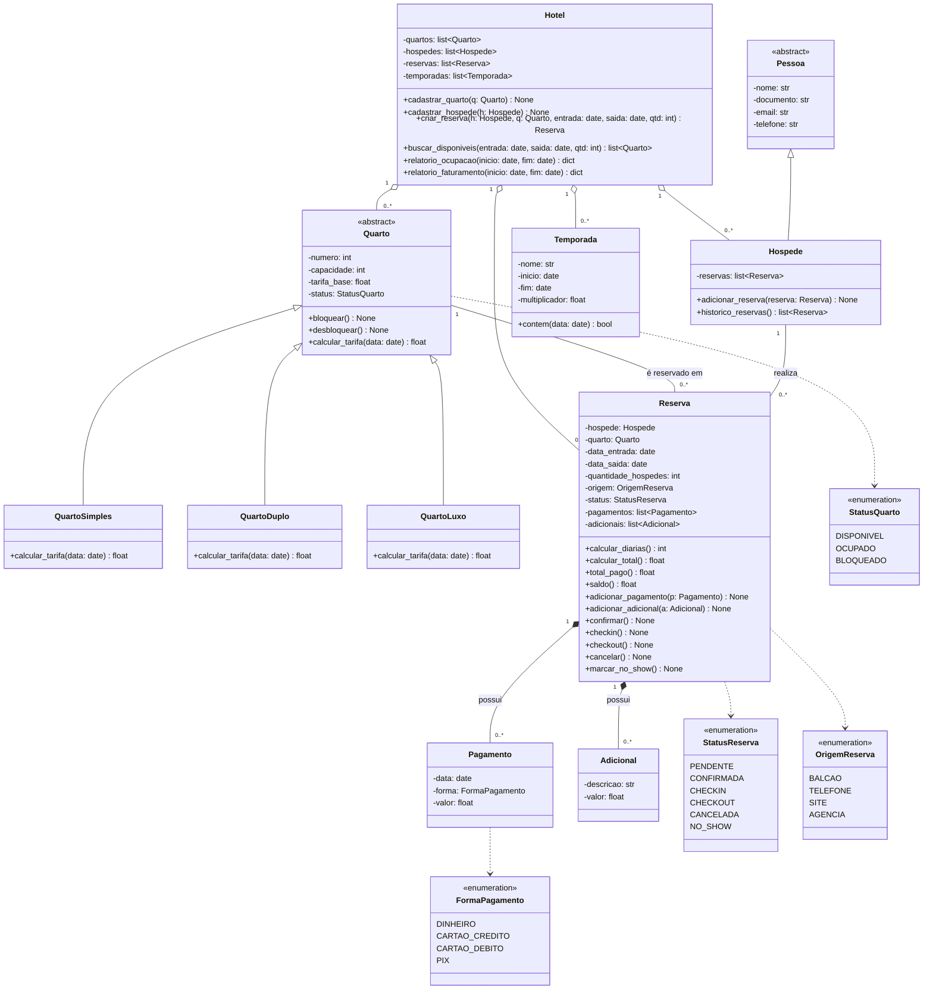
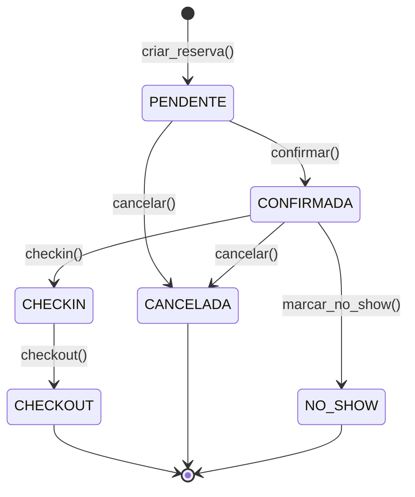

## Diagrama de Classes

```mermaid
classDiagram
    direction TB

    class Pessoa {
        <<abstract>>
        -nome: str
        -documento: str
        -email: str
        -telefone: str
    }

    class Hospede {
        -reservas: list~Reserva~
        +adicionar_reserva(reserva: Reserva) None
        +historico_reservas() list~Reserva~
    }

    class Quarto {
        <<abstract>>
        -numero: int
        -capacidade: int
        -tarifa_base: float
        -status: StatusQuarto
        +bloquear() None
        +desbloquear() None
        +calcular_tarifa(data: date) float
    }

    class QuartoSimples {
        +calcular_tarifa(data: date) float
    }
    class QuartoDuplo {
        +calcular_tarifa(data: date) float
    }
    class QuartoLuxo {
        +calcular_tarifa(data: date) float
    }

    class Reserva {
        -hospede: Hospede
        -quarto: Quarto
        -data_entrada: date
        -data_saida: date
        -quantidade_hospedes: int
        -origem: OrigemReserva
        -status: StatusReserva
        -pagamentos: list~Pagamento~
        -adicionais: list~Adicional~
        +calcular_diarias() int
        +calcular_total() float
        +total_pago() float
        +saldo() float
        +adicionar_pagamento(p: Pagamento) None
        +adicionar_adicional(a: Adicional) None
        +confirmar() None
        +checkin() None
        +checkout() None
        +cancelar() None
        +marcar_no_show() None
    }

    class Pagamento {
        -data: date
        -forma: FormaPagamento
        -valor: float
    }

    class Adicional {
        -descricao: str
        -valor: float
    }

    class Temporada {
        -nome: str
        -inicio: date
        -fim: date
        -multiplicador: float
        +contem(data: date) bool
    }

    class Hotel {
        -quartos: list~Quarto~
        -hospedes: list~Hospede~
        -reservas: list~Reserva~
        -temporadas: list~Temporada~
        +cadastrar_quarto(q: Quarto) None
        +cadastrar_hospede(h: Hospede) None
        +criar_reserva(h: Hospede, q: Quarto, entrada: date, saida: date, qtd: int) Reserva
        +buscar_disponiveis(entrada: date, saida: date, qtd: int) list~Quarto~
        +relatorio_ocupacao(inicio: date, fim: date) dict
        +relatorio_faturamento(inicio: date, fim: date) dict
    }

    class StatusReserva {
        <<enumeration>>
        PENDENTE
        CONFIRMADA
        CHECKIN
        CHECKOUT
        CANCELADA
        NO_SHOW
    }

    class StatusQuarto {
        <<enumeration>>
        DISPONIVEL
        OCUPADO
        BLOQUEADO
    }

    class FormaPagamento {
        <<enumeration>>
        DINHEIRO
        CARTAO_CREDITO
        CARTAO_DEBITO
        PIX
    }

    class OrigemReserva {
        <<enumeration>>
        BALCAO
        TELEFONE
        SITE
        AGENCIA
    }

    Pessoa <|-- Hospede
    Quarto <|-- QuartoSimples
    Quarto <|-- QuartoDuplo
    Quarto <|-- QuartoLuxo

    Hospede "1" -- "0..*" Reserva : realiza
    Quarto "1" -- "0..*" Reserva : é reservado em
    Reserva "1" *-- "0..*" Pagamento : possui
    Reserva "1" *-- "0..*" Adicional : possui

    Hotel "1" o-- "0..*" Quarto
    Hotel "1" o-- "0..*" Hospede
    Hotel "1" o-- "0..*" Reserva
    Hotel "1" o-- "0..*" Temporada

    Reserva ..> StatusReserva
    Reserva ..> OrigemReserva
    Quarto ..> StatusQuarto
    Pagamento ..> FormaPagamento
```

## Diagrama de Estados da Reserva

```mermaid
stateDiagram-v2
    [*] --> PENDENTE : criar_reserva()
    PENDENTE --> CONFIRMADA : confirmar()
    PENDENTE --> CANCELADA : cancelar()
    CONFIRMADA --> CHECKIN : checkin()
    CONFIRMADA --> CANCELADA : cancelar()
    CONFIRMADA --> NO_SHOW : marcar_no_show()
    CHECKIN --> CHECKOUT : checkout()
    CHECKOUT --> [*]
    CANCELADA --> [*]
    NO_SHOW --> [*]
```
